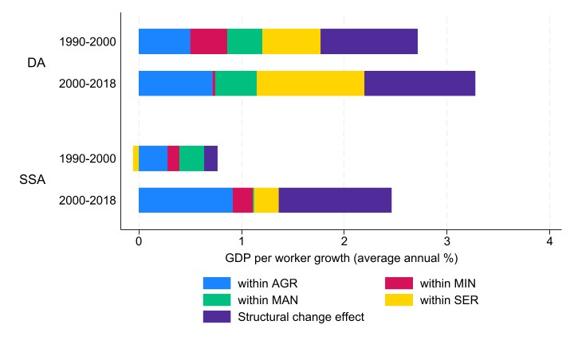

<!-- --- -->

<!-- ##### Download -->
<!-- + [Paper](Available upon request) -->
<!-- + [Online appendix](appendix2.pdf)
+ [Code and data](https://github.com/pmichaillat/unemployment-gap) -->

---

##### Abstract

We study the evolution of manufacturing value added shares in 11 sub-Saharan Africa (SSA) countries through the lens of an open economy model of structural change. Our analysis leverages recent developments in input-output tables in SSA countries. Our model allows for income effects via non-homothetic preferences, substitution and relative price effects, as well as comparative advantage and specialization effects. We calibrate our model to include each SSA country with nine other major economies for each year between 2000 and 2018. We also do a similar set of calibrations for 11 developing Asia (DA) countries. Our main results are that domestic and foreign sectoral TFP matter. Trade integration over time plays only a small role. However, trade as a transmission mechanism is important. Finally, the drivers and mechanisms of industrialization are similar in low-income SSA and DA countries.

---

##### Within-between decomposition results for Sub-Saharan Africa and developing Asia



<!-- --- -->

<!-- ##### Citation -->

<!-- Author 1 and Author 2. Year. "Title." *Journal* Volume (Issue): First page–Last page. https://doi.org/paper_doi. -->

<!-- ```BibTeX
@article{AAYY,
author = {Author 1 and Author 2},
doi = {paper_doi},
journal = {Journal},
number = {Issue},
pages = {XXX--YYY},
title ={Title},
volume = {Volume},
year = {Year}}
``` -->

---

##### Related material

+ [Presentation slides](presentation2.pdf)

