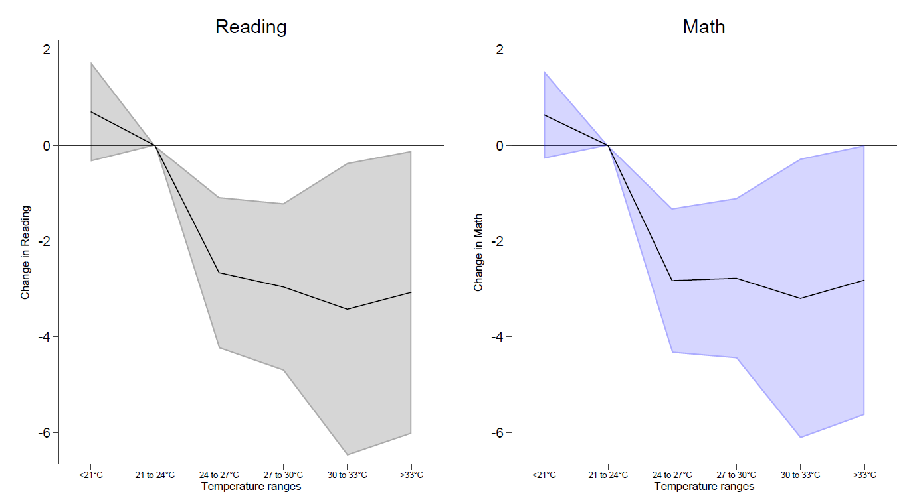

<!-- --- -->

##### Download

+ [Draft](temperature_learning_west_central_africa.pdf)
<!-- + [Online appendix](appendix1.pdf) -->
<!-- + [Code and data](https://github.com/pmichaillat/job-rationing) -->

---

##### Abstract

In this paper, we combine georeferenced temperature data with newly released learning data from 8 West and Central African (WCA) countries in the Programme on the Analysis of Education Systems (PASEC).  In the first part of the paper, we provide benchmark estimates of the effect of high temperatures on learning outcomes in WCA, thus providing an important comparison point with other parts of the world. We find preliminary evidence of a temperature-learning gradient with higher temperatures associated with worse math and reading scores for students in our sample.

---

##### Change in Reading and Math Score by Temperature



<!-- --- -->

<!-- ##### Citation -->

<!-- Author. Year. "Title." *Journal* Volume (Issue): First page–Last page. https://doi.org/paper_doi.

```BibTeX
@article{AAYY,
author = {Author},
doi = {paper_doi},
journal = {Journal},
number = {Issue},
pages = {XXX--YYY},
title ={Title},
volume = {Volume},
year = {Year}}
``` -->

<!-- --- -->

<!-- ##### Related material -->

<!-- + [Presentation slides](presentation1.pdf)
+ [Dissertation title](https://escholarship.org/uc/item/7jr3m96r) – PhD dissertation on which this paper is based.
+ [Column title](https://cep.lse.ac.uk/pubs/download/cp365.pdf) – Nontechnical column describing the paper. -->