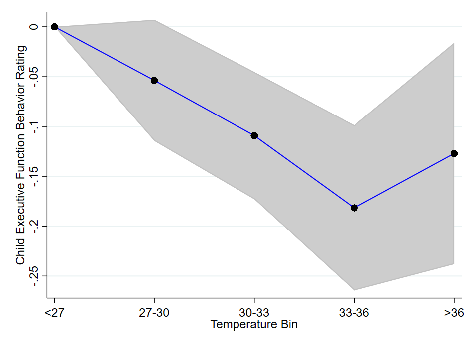

<!-- --- -->

<!-- ##### Download -->

<!-- + [Draft](heat_executive_function_behavior.pdf) -->
<!-- + [Online appendix](appendix1.pdf) -->
<!-- + [Code and data](https://github.com/pmichaillat/job-rationing) -->

---

##### Abstract

I exploit the variation among potential primary school graduating cohorts by taking advantage of a subsidy given to girls to attend secondary school in Benin starting from 2010. I investigated the effect of the policy on Educational outcomes. Preliminary findings suggest that the policy increases primary school completion by 6 percentage points and increases grade 7 enrolment (secondary school) of 5 percentage points.

<!-- --- -->

<!-- ##### Effects of Heat on Child Executive Function Behavior

 -->

<!-- --- -->

<!-- ##### Citation -->

<!-- Author. Year. "Title." *Journal* Volume (Issue): First page–Last page. https://doi.org/paper_doi.

```BibTeX
@article{AAYY,
author = {Author},
doi = {paper_doi},
journal = {Journal},
number = {Issue},
pages = {XXX--YYY},
title ={Title},
volume = {Volume},
year = {Year}}
``` -->

<!-- --- -->

<!-- ##### Related material -->

<!-- + [Presentation slides](presentation1.pdf)
+ [Dissertation title](https://escholarship.org/uc/item/7jr3m96r) – PhD dissertation on which this paper is based.
+ [Column title](https://cep.lse.ac.uk/pubs/download/cp365.pdf) – Nontechnical column describing the paper. -->